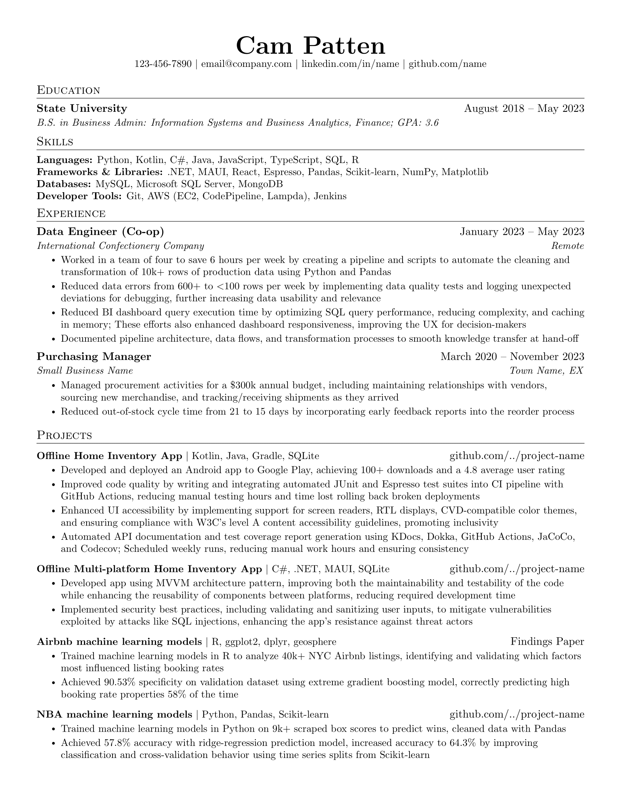

### Overview
A single-page, one-column resume template for software developers. Custom commands are used to provide consistent formatting.
Based on [Sourabh Bajaj](https://github.com/sb2nov/resume)'s popular resume template.

### Quick Start
View the source code on [Overleaf](https://www.overleaf.com/read/jyctjfsynjxh#c8a46f).

### Preview

